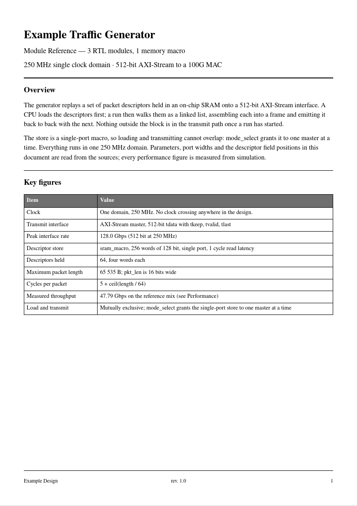
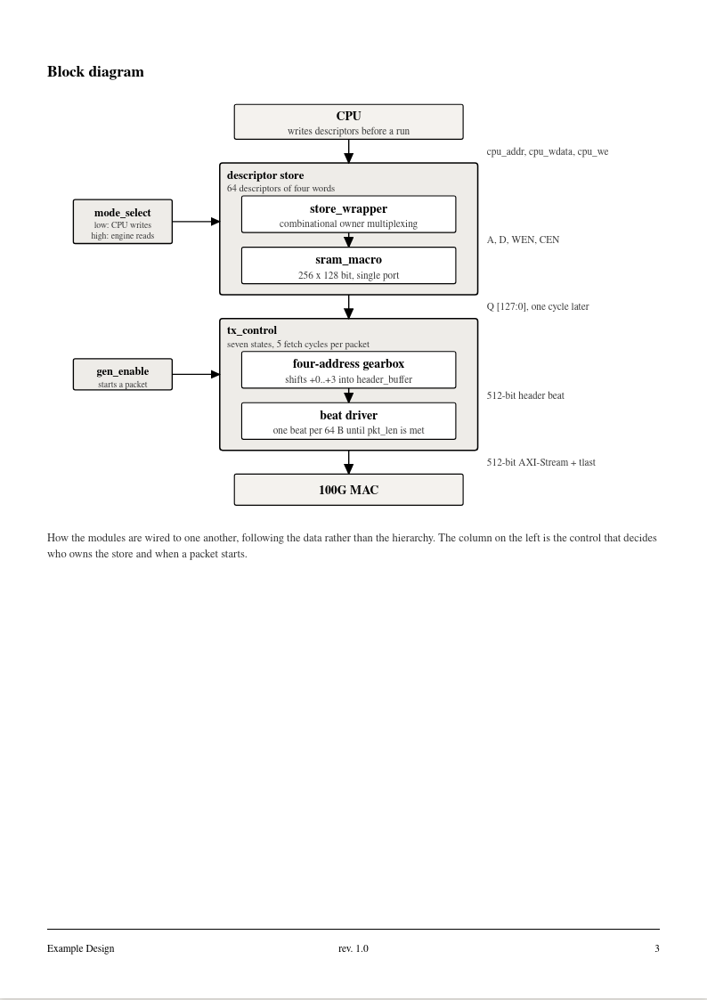

# ic-datasheet

A [Claude Code](https://claude.com/claude-code) skill that turns a Verilog project into a
printable A4 datasheet — module symbols, pin tables, a connectivity block diagram, timing
waveforms and a register map, in the style of a foundry IP datasheet.

Output is two files: an **HTML** you can keep editing, and an **A4 PDF** you can print or mail.

<p align="center">
  
  
</p>

<p align="center"><sub>Sample output. Module names are anonymised.</sub></p>

## What it actually does

Facts come out of the RTL; prose is written by hand. That split is the whole design:

| | Source | On a re-run |
|---|---|---|
| Parameters, ports, bit widths, instantiations | parsed from the Verilog | regenerated |
| Overview, per-module description, signal notes | written by you, in `build.py` | left alone |

Generating descriptions from RTL only ever produces `wr_go is the wr_go signal`, so the skill
does not try. What it does automate is everything tedious and error-prone: resolving
`[HBM_CH*ID_WIDTH-1:0]` into `[95:0]`, laying out symbols so no label is truncated, splitting a
63-pin table across pages, and refusing to emit a PDF when a page does not actually fit A4.

## Install

```sh
git clone https://github.com/charlesHYC/ic_doc-datasheet ~/.claude/skills/ic-datasheet
```

Then in Claude Code:

```
/ic-datasheet <your project>
```

Claude reads `SKILL.md` and drives the scripts. You can also run them by hand — see below.

## Requirements

- Python 3.8+ for `extract.py` / `build.py` / `paginate.py`
- [Pillow](https://pypi.org/project/Pillow/) and Firefox for `topdf.py`

If your machine has several Pythons, Pillow may not be installed in the one that runs
`build.py`. That is normal; just spell out the interpreter paths.

## By hand

```sh
# 1. Parse the module headers. List the files explicitly - do NOT glob *.v,
#    because file names and module names do not always agree.
python3 scripts/extract.py rtl/a.v rtl/b.v > modules.json

# 2. Assemble the HTML (start from example/build.py and edit PROSE)
python3 build.py

# 3. Check every page really fits A4, then convert
python3 scripts/topdf.py my_design_datasheet_manual.html --check
python3 scripts/topdf.py my_design_datasheet_manual.html
```

## What's in here

| Path | |
|---|---|
| `SKILL.md` | the skill: workflow, layout rules, and the traps worth knowing |
| `scripts/extract.py` | Verilog-2001 module header parser → JSON |
| `scripts/paginate.py` | height estimates, so long tables split before they overflow |
| `scripts/topdf.py` | HTML → A4 PDF, and the page-fits-A4 check |
| `scripts/wave.py` | timing figure renderer |
| `scripts/blocks.py` | connectivity block diagram layout |
| `example/build.py` | a real project's assembly script — copy it and edit |

`extract.py`, `paginate.py` and `topdf.py` are project-independent. `wave.py` and `blocks.py`
have generic renderers but the content of each figure is written per project.

## Two traps that cost real time

**A page that does not fit A4 gives no warning.** `min-height: 297mm` on `.page` is a
*minimum* — too much content and the div simply grows. Stacked on screen it looks perfect,
footer and all, but printing repaginates it and converting crops it. The first version of the
example datasheet had 11 of 16 pages over, one by 310 mm, and nobody noticed. `topdf.py --check`
measures every page and refuses to convert until they all fit.

**Firefox has no `--print-to-pdf`.** Only `--screenshot`, which silently writes nothing if you
give it a relative path. `topdf.py` renders each page under `transform: scale(N)` and stitches
the results, so the PDF's layout is identical to the HTML you verified — at the cost of text
not being selectable.

## Example

`example/build.py` is the assembly script for a real 29-page datasheet: 6 RTL modules, 4
waveforms taken from simulation, and a memory-mapped register map. Copying it and replacing
the `PROSE`, `CSR`, `LIB` and `FULL` constants is the fastest way to start; the CSS, the
symbol renderer, the table builders and the pagination all carry over unchanged.

## License

MIT — see [LICENSE](LICENSE).
